<p align="center">
  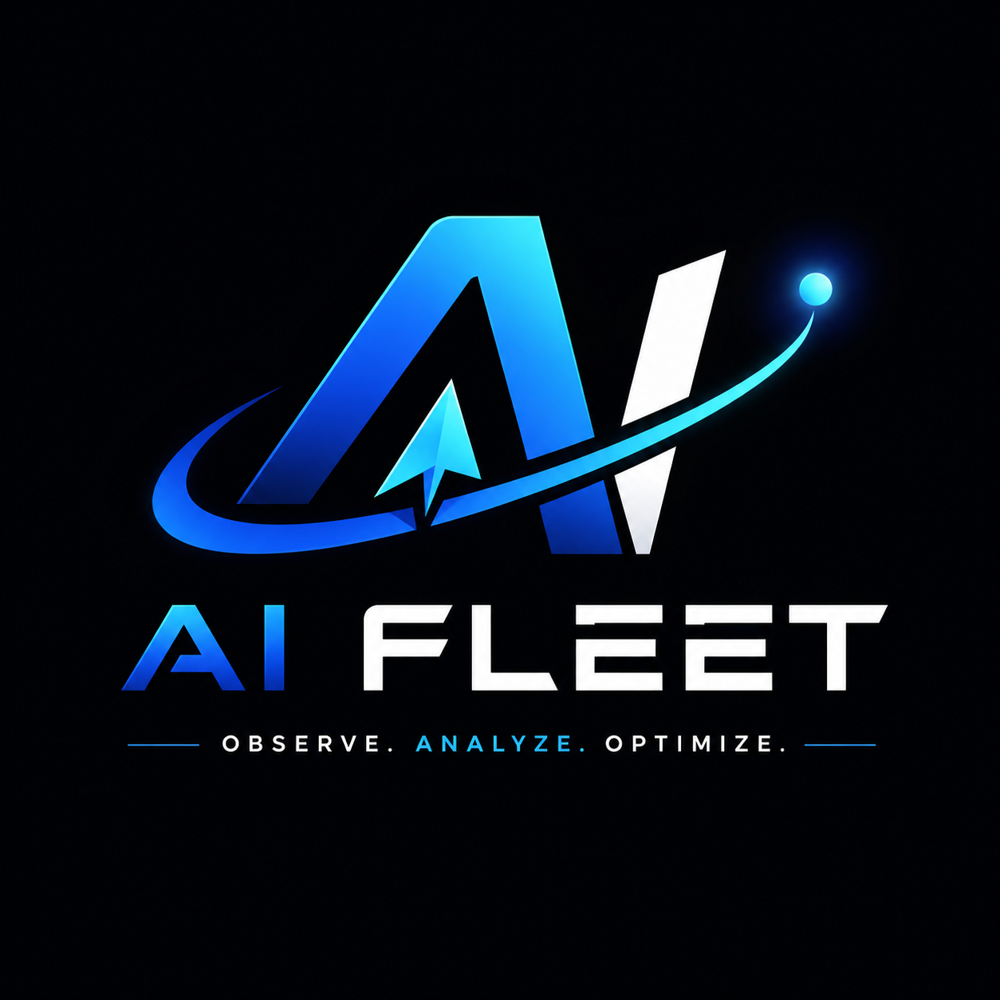
</p>

<h1 align="center">AIFleet Incident Observability</h1>

<p align="center">
  AI-powered production incident analysis, built on <b>n8n</b>, <b>Google Gemini</b>, <b>OpenTelemetry</b> and <b>SigNoz Cloud</b>.
</p>

<p align="center">
  
  
  
  
  
  
</p>

<p align="center">
  <a href="https://satvik-creations.github.io/AIFleet-Incident-Observability/">🎛️ Open Command Center</a> ·
  <a href="https://drive.google.com/file/d/1KOht8MDn5cB7ryfHa0A4Nb1LGfxTMDrN/view?usp=sharing">🎥 Watch the Demo</a> ·
  <a href="https://github.com/Satvik-Creations/AIFleet-Incident-Observability/tree/main/demo">🚀 Getting Started</a> ·
  <a href="https://github.com/Satvik-Creations/AIFleet-Incident-Observability/tree/main/screenshots">📸 Screenshots</a> ·
  <a href="https://github.com/Satvik-Creations/AIFleet-Incident-Observability/blob/main/LICENSE">📜 License</a>
</p>

---

# 🎬 Watch the Demo First

> **⭐ Recommended for Judges:** This **3-minute demonstration** showcases the complete workflow—from receiving a production incident to AI-powered analysis, automated incident report generation, and end-to-end observability with OpenTelemetry and SigNoz.

<p align="center">

<a href="https://drive.google.com/file/d/1KOht8MDn5cB7ryfHa0A4Nb1LGfxTMDrN/view?usp=sharing">

alt="Watch the Demo"
width="100%">

</a>

</p>

<p align="center">

<a href="https://drive.google.com/file/d/1KOht8MDn5cB7ryfHa0A4Nb1LGfxTMDrN/view?usp=sharing">


</a>

</p>

<p align="center">
<b>💡 We recommend watching the demo before exploring the documentation below.</b>
</p>

---

## Contents

- [Overview](#overview)
- [Problem Statement](#problem-statement)
- [Solution](#solution)
- [Features](#features)
- [Architecture](#architecture)
- [Workflow Stages](#workflow-stages)
- [Observability with OpenTelemetry & SigNoz](#observability-with-opentelemetry--signoz)
- [Repository Structure](#repository-structure)
- [Getting Started](#getting-started)
- [Project Screenshots](#project-screenshots)
- [Technology Stack](#technology-stack)
- [Design Decisions](#design-decisions)
- [Security & Best Practices](#security--best-practices)
- [Future Enhancements](#future-enhancements)
- [Contributing](#contributing)
- [Acknowledgements](#acknowledgements)
- [License](#license)

---

## Overview

**⚠️ "This project uses SigNoz Cloud as the observability backend!"**

Production systems generate thousands of logs and alerts every day. When an incident hits, engineers typically lose valuable time manually digging through logs, tracing root causes, and deciding on the right corrective action.

**AIFleet Incident Observability** removes that manual overhead by combining an AI agent, workflow automation, and distributed tracing into a single pipeline. When a production incident lands on the webhook, the workflow automatically:

- Receives and normalizes the incident payload
- Analyzes it using Google Gemini
- Generates an AI-powered incident report (severity, root cause, recommended actions, summary)
- Returns a structured response to the caller
- Exports full execution telemetry via OpenTelemetry
- Visualizes every run inside SigNoz Cloud

The result isn't just "the workflow ran" — it's full visibility into *how* it ran: per-node execution, latency, bottlenecks, and complete distributed traces.

---

## Problem Statement

Teams handling production incidents commonly run into the same pain points:

- Manual, time-consuming incident investigation
- Slow root cause analysis
- No visibility into workflow execution
- Difficult debugging with no execution timeline
- Limited production-grade observability

Without tracing, pinpointing which step in an automated pipeline is responsible for a slowdown or failure is far harder than it needs to be.

## Solution

AIFleet combines four technologies into one production-ready pipeline:

| Component | Responsibility |
|---|---|
| **n8n** | Workflow orchestration |
| **Google Gemini** | AI-driven incident analysis |
| **OpenTelemetry** | Distributed tracing instrumentation |
| **SigNoz Cloud** | Trace storage, visualization & observability |

Together, they turn incident response into an automated, fully observable pipeline — from webhook to root-cause report.

---

## Features

- **🤖 AI-Powered Incident Analysis** — Google Gemini evaluates severity, likely root cause, recommended actions, and produces an executive summary for every incident.
- **⚡ Webhook-Based Ingestion** — Incidents arrive over a simple HTTP webhook, making it easy to wire up any monitoring or alerting tool.
- **🔄 Fully Automated Orchestration** — The entire incident lifecycle runs through n8n with zero manual intervention.
- **📊 Production Observability** — Workflow- and node-level traces, execution timelines, and performance insights via SigNoz Cloud.
- **🔍 Distributed Tracing** — Every execution generates a distributed trace for complete post-incident analysis.
- **🔥 Flame Graph Analysis** — Instantly spot which node is slowing the pipeline down.
- **🌊 Waterfall View** — See execution order and per-span latency at a glance.
- **📡 Zero-Code Instrumentation** — OpenTelemetry captures everything without touching the workflow's business logic.

---

## Architecture

<p align="center">
  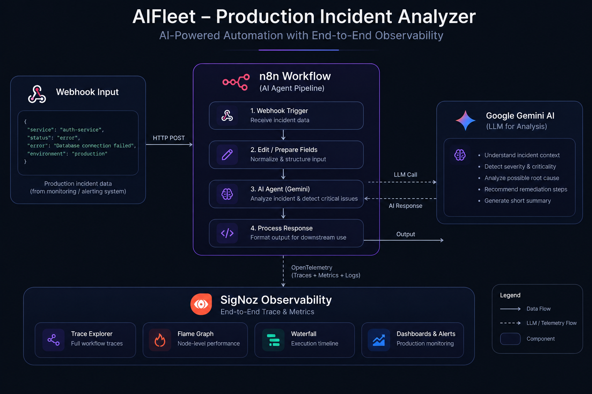
</p>

```text
                Production Incident
                        │
                        ▼
                HTTP Webhook Trigger
                        │
                        ▼
                  n8n Workflow Engine
                        │
            ┌───────────┴────────────┐
            ▼                        ▼
     Data Preparation          Google Gemini
            │                        │
            └───────────┬────────────┘
                        ▼
              AI Incident Analysis
                        │
                        ▼
             Structured JSON Response
                        │
                        ▼
              OpenTelemetry Exporter
                        │
                        ▼
                  SigNoz Cloud
                        │
                        ▼
       Trace Explorer • Flame Graph • Waterfall
```

---

## Workflow Stages

The pipeline is built as six logical stages inside n8n:

<p align="center">
  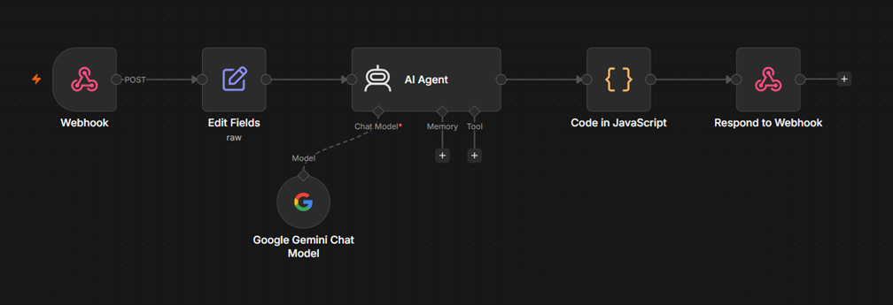
</p>

| # | Stage | Description |
|---|---|---|
| 1 | **Webhook Trigger** | Receives the incoming incident payload — e.g. `{"service": "Payment Service", "status": "Critical", "error": "Database Connection Timeout", "environment": "Production"}` |
| 2 | **Edit Fields** | Normalizes the raw payload so a consistent shape reaches the AI agent |
| 3 | **AI Agent** | Acts as an intelligent DevOps engineer, evaluating severity, impact, and probable root cause |
| 4 | **Google Gemini** | Powers the underlying reasoning behind the AI agent's analysis |
| 5 | **Code Node** | Formats the AI's output into a structured JSON payload, adding a timestamp and execution status |
| 6 | **Response** | Returns the final AI-generated incident report to the caller |

**Execution lifecycle, end to end:**

<p align="center">
  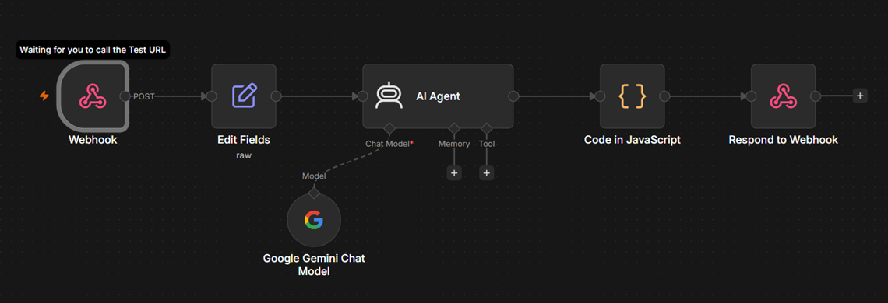
  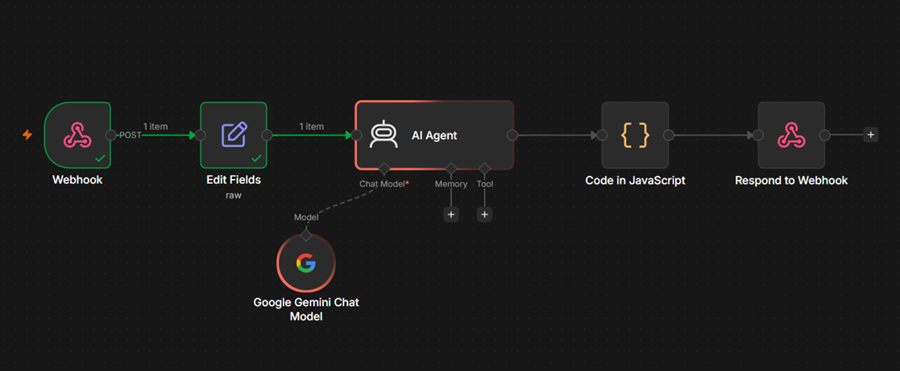
  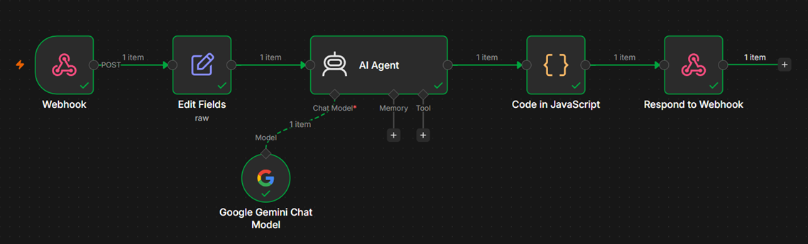
</p>

---

## Observability with OpenTelemetry & SigNoz

Every execution is instrumented end-to-end with **OpenTelemetry (OTel)**, with traces exported directly from n8n into **SigNoz Cloud** — no changes to business logic required.

**Enabled instrumentation:**

- ✅ Workflow-level tracing
- ✅ Node-level tracing
- ✅ Published workflow tracking
- ✅ Trace context propagation
- ✅ OTLP export
- ✅ SigNoz Cloud integration

### SigNoz Cloud Dashboard

<p align="center">
  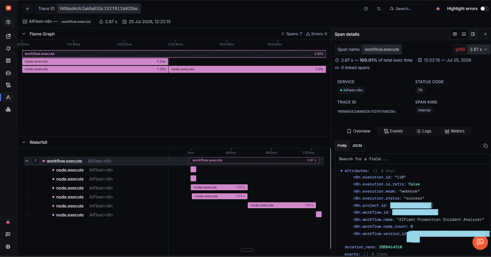
</p>

SigNoz collects, stores, and visualizes every trace generated by the workflow — giving engineers a real-time view of the execution lifecycle instead of manually reading through logs.

### Flame Graph

<p align="center">
  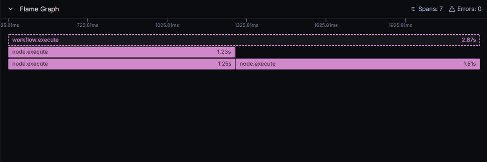
</p>

Visualizes exactly where execution time goes across the workflow, making slow nodes and bottlenecks immediately obvious.

### Waterfall View

<p align="center">
  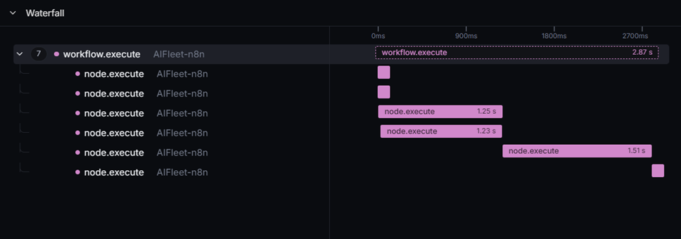
</p>

Shows execution order, per-span duration, and parent-child relationships — ideal for understanding the sequential behavior of a run.

### Span Details

<p align="center">
  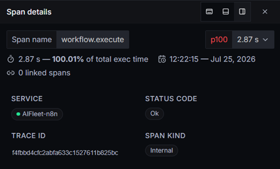
</p>

**Curated trace metadata** — rather than exposing the raw OpenTelemetry payload, only the metadata useful for understanding execution is surfaced:

```json
{
  "workflow": "AIFleet Production Incident Analyzer",
  "service": "AIFleet-n8n",
  "execution_mode": "webhook",
  "status": "success",
  "runtime": "Node.js 24.16.0",
  "nodes": 6,
  "span": "workflow.execute",
  "duration_ms": 2866.41
}
```

---

## Repository Structure

```text
AIFleet-Incident-Observability
│
├── .github/workflows         # CI configuration
├── assets/AIFleet             # Branding assets (logo)
├── backend                    # Supporting backend service
├── demo                        # Demo-related assets
├── docs                        # Additional project documentation
├── n8n_workflow                # Exported n8n workflow JSON
├── screenshots                 # All README screenshots, organized by feature
│   ├── architecture
│   ├── n8n_workflow_display
│   ├── signoz.workflow.execute
│   ├── command_center_reports
│   ├── timed_execution_report_traces_15;11-25-07-2026
│   └── acknowledgements
│
├── casting.yaml / casting.yaml.lock
├── index.html
├── LICENSE
└── README.md
```

---

## Getting Started

### Prerequisites

- An n8n instance (cloud or self-hosted)
- A Google Gemini API key
- A SigNoz Cloud workspace
- Git

### 1. Clone the repository

```bash
git clone https://github.com/Satvik-Creations/AIFleet-Incident-Observability.git
cd AIFleet-Incident-Observability
```

### 2. Import the workflow

Import the JSON file from the [`n8n_workflow/`](n8n_workflow) folder into your n8n instance.

### 3. Configure Google Gemini credentials

Create a Google Gemini credential inside n8n and attach it to the **AI Agent** node.

### 4. Publish the workflow

Publish it in n8n to enable production execution and observability.

### 5. Configure OpenTelemetry

Enable OpenTelemetry from n8n's settings with the following configuration:

| Setting | Value |
|---|---|
| Exporter | OTLP |
| Tracing | Enabled |
| Node Spans | Enabled |
| Published Workflow Tracking | Enabled |
| Trace Propagation | Enabled |

> **Note:** The exact OTLP endpoint and authentication details depend on your observability backend. Never commit secrets or ingestion keys to the repository.

### 6. Trigger the workflow

Send a request to the webhook, e.g.:

```json
{
  "service": "Payment Service",
  "status": "Critical",
  "error": "Database Connection Timeout",
  "environment": "Production"
}
```

The workflow will receive the incident, analyze it with Gemini, generate recommendations, export OpenTelemetry traces, and surface the full execution in SigNoz Cloud.

---

## Project Screenshots

### Command Center Reports

A rolling view of AI-generated incident reports as they're produced.

<p align="center">
  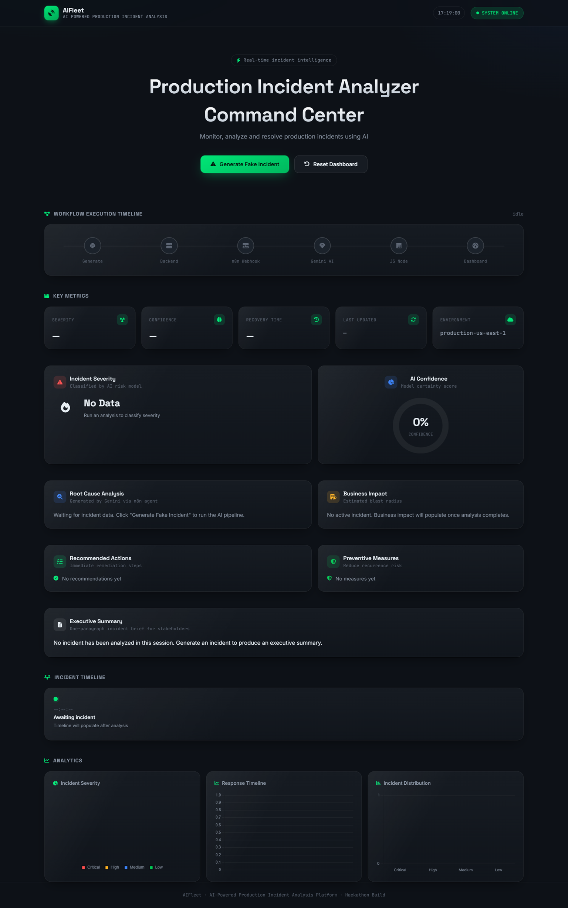
  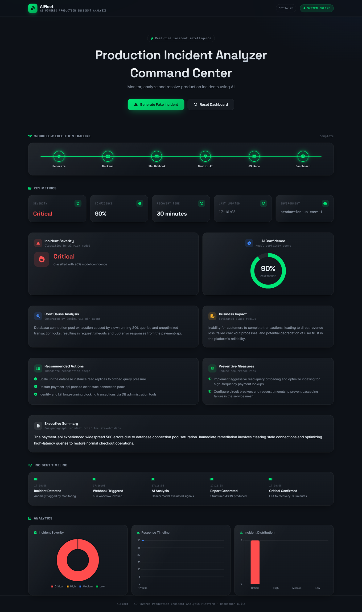
  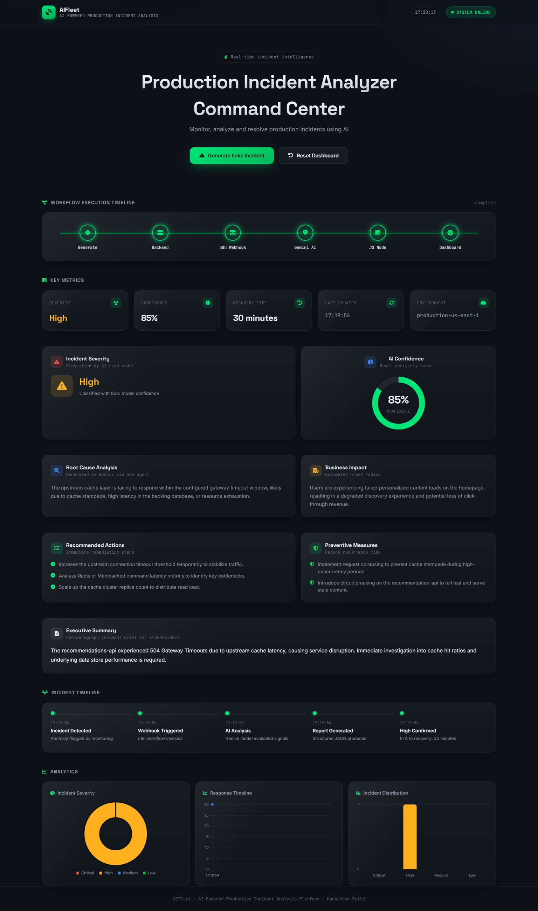
</p>

<details>
<summary>See more command center reports</summary>
<br>
<p align="center">
  
  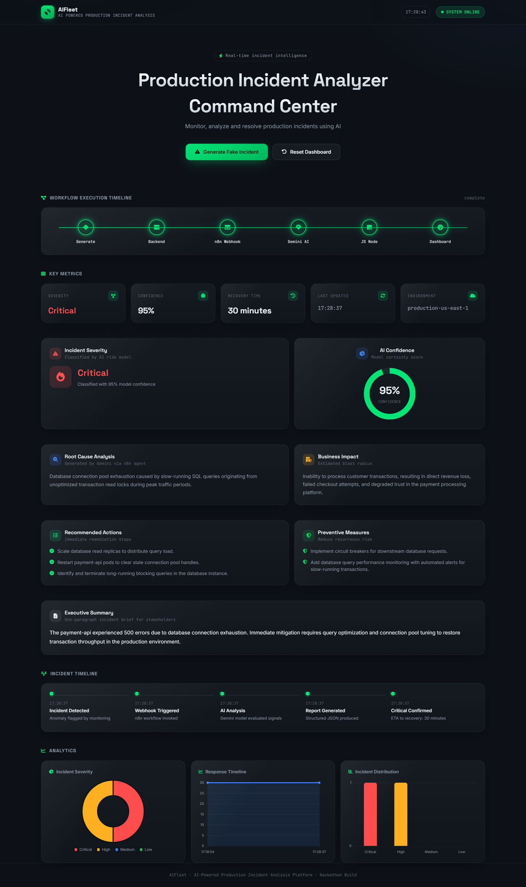
  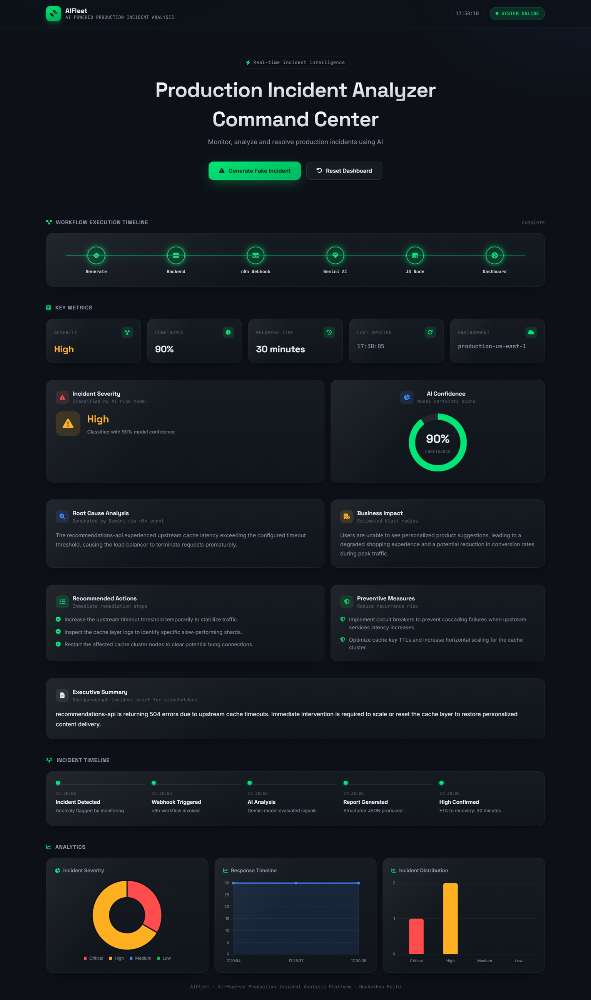
  
</p>
</details>

### Timed Execution Snapshot

A synchronized view of the command center, n8n execution, and SigNoz traces for a single run.

<p align="center">
  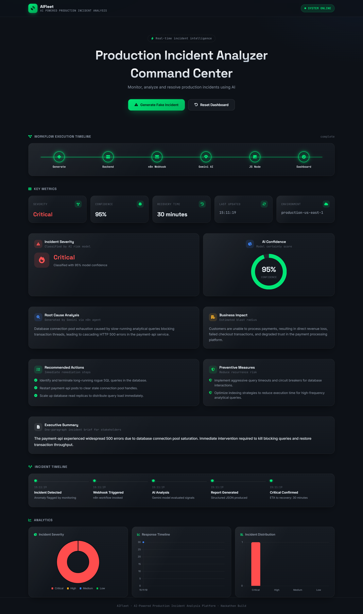
  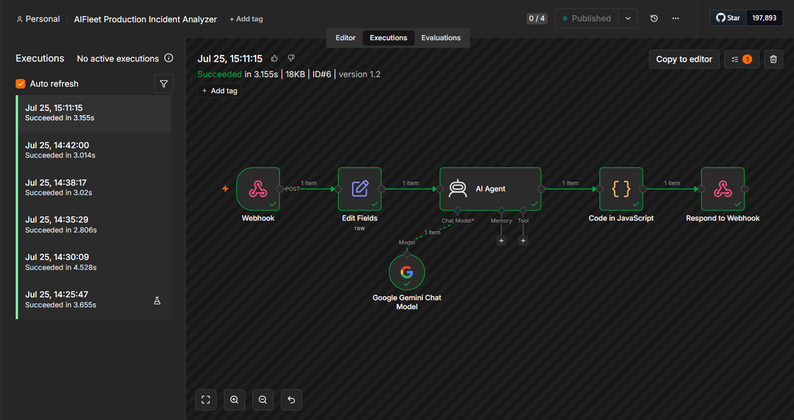
  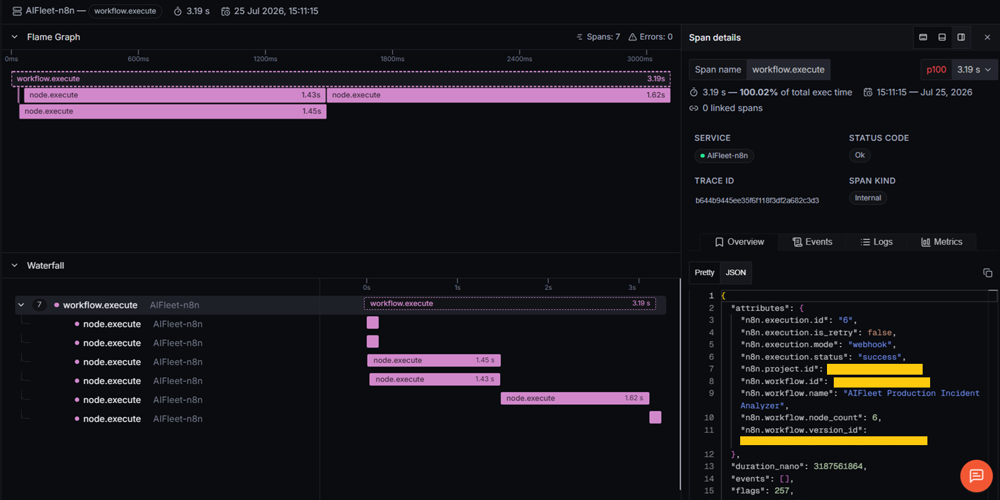
</p>

---

## Technology Stack

| Category | Technology |
|---|---|
| Workflow Automation | n8n |
| Artificial Intelligence | Google Gemini |
| Observability Platform | SigNoz Cloud |
| Telemetry Standard | OpenTelemetry |
| Runtime | Node.js |
| Communication | HTTP Webhooks |
| Data Format | JSON |
| Version Control | Git & GitHub |

---

## Design Decisions

- **AI-assisted analysis, not hardcoded rules** — Google Gemini dynamically evaluates each incident rather than relying on static response templates.
- **Visual, maintainable automation** — n8n keeps the pipeline transparent and easy to extend without sacrificing automation.
- **Zero-touch instrumentation** — OpenTelemetry traces every execution without any changes to the workflow's business logic.
- **Cloud-native observability** — all traces are exported directly to SigNoz Cloud for centralized monitoring, instead of relying on local logs.
- **Security by design** — see [Security & Best Practices](#security--best-practices) below.

---

## Security & Best Practices

This repository intentionally excludes any sensitive configuration, including:

- API keys and authorization headers
- OTLP authentication tokens
- SigNoz ingestion keys
- Environment secrets
- Internal workspace credentials

Only representative workflow metadata and screenshots are included, to demonstrate the observability implementation while following secure sharing practices.

---

## Future Enhancements

- Multi-provider LLM support
- Slack / Microsoft Teams incident notifications
- Automated incident ticket creation
- Historical incident analytics
- Intelligent incident classification
- Service-level dashboards
- Real-time alerting
- Root cause correlation across multiple workflows
- Support for additional observability backends

---

## Contributing

Contributions, ideas, and discussions are always welcome.

1. Fork the repository
2. Create a feature branch
3. Commit your changes
4. Open a pull request

---

## Acknowledgements

This project builds on several excellent open-source technologies and platforms:

- **[SigNoz](https://signoz.io)** — open-source observability platform for distributed tracing and monitoring
- **[n8n](https://n8n.io)** — workflow automation platform
- **Google Gemini** — the LLM powering AI-driven incident analysis
- **OpenTelemetry** — vendor-neutral standard for telemetry generation
- **GitHub** — collaboration and version control

<p align="center">
  
</p>
 
---

## License

Licensed under the **MIT License** — see [`LICENSE`](LICENSE) for details.

---

<p align="center">
  Built with ❤️ by <b>Team AI Fleet</b><br>
  <sub>⭐ If this project was useful, consider starring the repo — it helps a lot.</sub>
</p>
