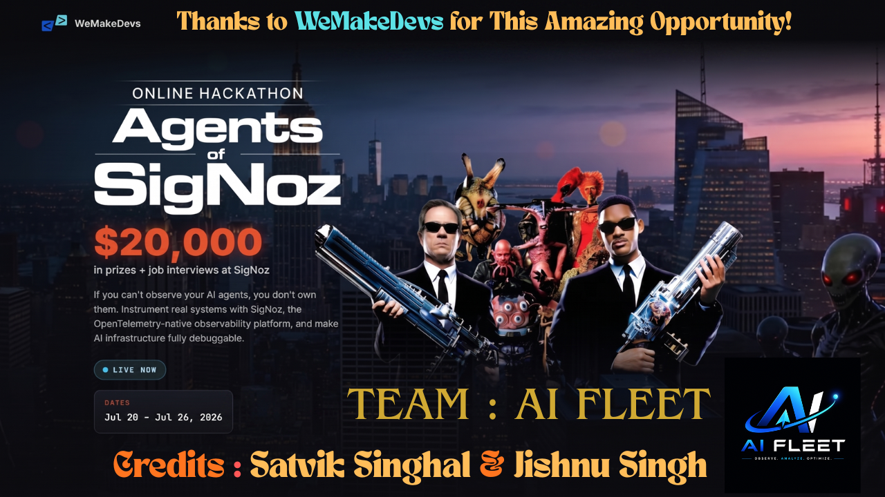

# 🙏 Acknowledgements

---

## Thank You

This project was developed as part of the **Agents of SigNoz Hackathon**, organized by **WeMakeDevs** in collaboration with **SigNoz**.

We sincerely thank the organizers for creating a platform that encouraged innovation in AI, observability, automation, and production engineering. The hackathon provided an excellent opportunity to learn, experiment, and build real-world AI-powered solutions.

---

## Special Thanks

- **WeMakeDevs** — For organizing and hosting an incredible hackathon experience.
- **SigNoz** — For providing an outstanding open-source observability platform and comprehensive learning resources.
- **OpenTelemetry Community** — For building the open standard that powers modern observability.
- **n8n** — For making workflow automation accessible, flexible, and production-ready.
- **Google Gemini** — For enabling intelligent AI-powered incident analysis.

---

## Team AI Fleet

This project was proudly built by **Team AI Fleet**.

### Team Members

- **Satvik Singhal**
- **Jishnu Singh**

---

## Our Gratitude

We are grateful to everyone who contributed to the open-source ecosystem and shared valuable documentation, tools, tutorials, and community support throughout this journey.

This project represents our passion for AI, automation, observability, and continuous learning.

---

### ❤️ Thank you for supporting Team AI Fleet.

**Observe • Analyze • Optimize**

