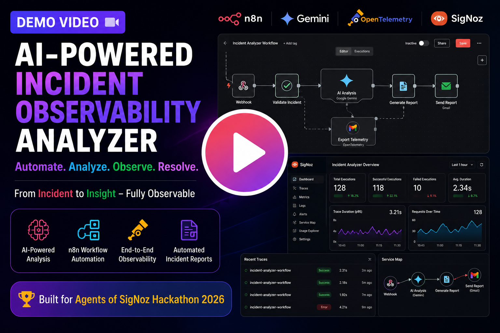

# 🚀 Incident Observability Analyzer

### AI-Powered Incident Response using n8n, Gemini, OpenTelemetry & SigNoz

  
  
  

---

# 🎬 WATCH THE FULL DEMO

## ⭐ This demo showcases the complete project built during the Agents of SigNoz Hackathon.

### **Click the thumbnail below to watch the complete demonstration**

  

# ▶️ [CLICK HERE TO WATCH THE DEMO VIDEO](https://drive.google.com/file/d/1KOht8MDn5cB7ryfHa0A4Nb1LGfxTMDrN/view?usp=sharing)

---

### ⚡ Built for the **Agents of SigNoz Hackathon 2026**

